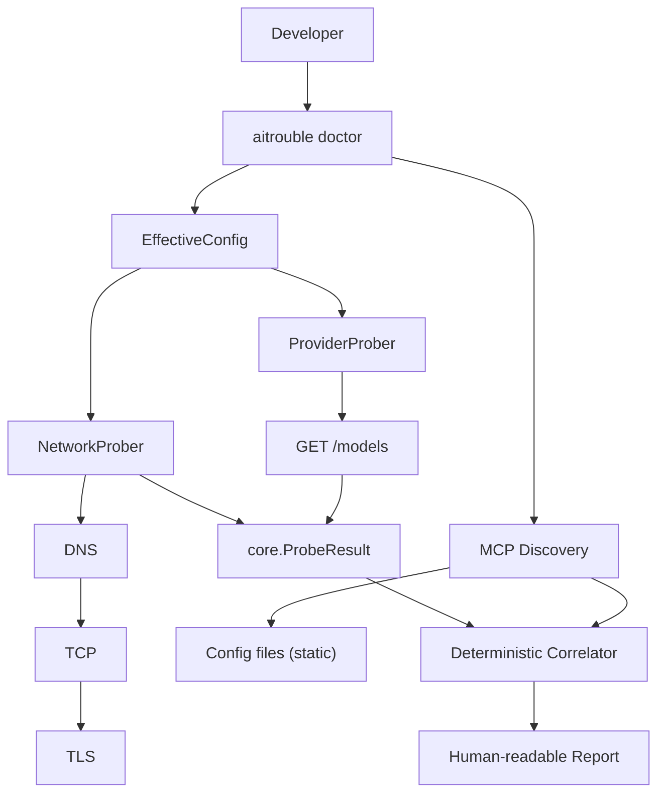
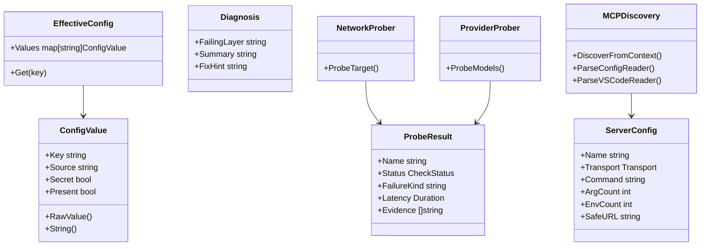

# Architecture

## 1. Purpose

`aitrouble` is a read-only, single-binary CLI tool that diagnoses AI integration failures across the local environment, network, and provider layers without leaking credentials.

## 2. Current System

The current system implements:

- Deterministic configuration resolution (`shell → .env → default`)
- Bottom-up network probing (DNS → TCP → TLS)
- OpenAI-compatible `/models` provider probe
- `aitrouble doctor` CLI orchestration with human-readable diagnosis
- Local MCP configuration discovery (static, read-only — no process execution)

## 3. Production Package Structure

All production packages use standard library only, with no third-party dependencies:

- `internal/core` — common domain types: `ProbeResult`, `EffectiveConfig`, `ConfigValue`, `Diagnosis`; local `.env` parsing and config resolution
- `internal/network` — deterministic DNS, TCP, and TLS probes with short-circuit semantics
- `internal/provider` — safe HTTP probes against OpenAI-compatible `/models` endpoints; classifies HTTP status codes without exposing raw response bodies or credentials
- `internal/diagnosis` — correlates probe results into deterministic failure layers
- `internal/doctor` — orchestrates the CLI workflow; prints safe human-readable diagnostic output; integrates MCP discovery
- `internal/mcp` — local MCP configuration file discovery and static parsing; never executes discovered commands

## 4. Current Data Flow



> **Note:** MCP discovery feeds the report and can surface a `MCP › Configuration` diagnosis when a config file exists but is malformed. It does not replace or override network/provider failures.

## 5. Core Domain Model



## 6. Configuration Resolution

Supported configuration keys:
- `OPENAI_API_KEY`
- `OPENAI_BASE_URL` (default: `https://api.openai.com/v1`)

Precedence:
```text
shell environment
        ↓
.env file
        ↓
default
```

- A missing `.env` is silently skipped. Actual filesystem errors (permissions, etc.) are surfaced.
- `OPENAI_API_KEY` is treated as a secret. `RawValue()` is provided strictly for internal HTTP request authorization.

## 7. Network Probe Flow

HTTPS short-circuit:
```text
DNS fail → TCP skipped → TLS skipped
DNS pass → TCP fail → TLS skipped
DNS pass → TCP pass → TLS runs
```

HTTP short-circuit:
```text
DNS → TCP (TLS is skipped for plain http:// targets)
```

## 8. Provider Probe

The provider probe executes an OpenAI-compatible API request using the resolved config.

```text
EffectiveConfig → OPENAI_BASE_URL → GET /models → HTTP result → core.ProbeResult
```

Result classification:
- `200` → `pass`
- `401/403` → `auth_failure`
- `404` → `route_not_found`
- `429` → `rate_limited`
- `5xx` → `provider_server_error`
- Other non-2xx → `provider_http_error`
- Invalid response → `provider_invalid_response`
- Timeout → `http_timeout`

## 9. MCP Discovery (M5A — Static, Read-only)

`internal/mcp` discovers MCP server definitions from well-known client config locations:

| Source | Path |
|---|---|
| Cursor | `~/.cursor/mcp.json` |
| Claude Desktop (Windows) | `%APPDATA%\Claude\claude_desktop_config.json` |
| Claude Desktop (macOS) | `~/Library/Application Support/Claude/claude_desktop_config.json` |
| Claude Desktop (Linux) | `$XDG_CONFIG_HOME/Claude/claude_desktop_config.json` |
| VS Code workspace | `<cwd>/.vscode/mcp.json` (uses `servers` key) |
| Portable | `<cwd>/.mcp.json` (uses `mcpServers` key) |

Security invariants:
- MCP commands are **never executed**.
- Env variable values are **never stored or printed** (only count is reported).
- HTTP URL credentials and sensitive query parameters are redacted via `RedactURL()` before any display.
- Raw args are never printed.

MCP diagnosis semantics:
- No config found → `StatusSkip` (not a failure; most machines have no MCP config)
- Config found and valid → `StatusPass`
- Config found but malformed → `StatusFail` → diagnosis `MCP › Configuration`

## 10. Security Model

```text
API key → EffectiveConfig → Authorization header → provider request

NOT in:
  ProbeResult.Name
  ProbeResult.FailureKind
  ProbeResult.Evidence
  formatted output
  MCP server config display
```

If a remote server echoes the API key back in an error body, the `ProbeResult` still fully redacts it. MCP HTTP URL tokens/passwords are redacted before being stored in `ServerConfig.SafeURL`.

## 11. Current Limitations

- Only `OPENAI_API_KEY` and `OPENAI_BASE_URL` are currently supported.
- Provider probe scope is restricted to OpenAI-compatible `/models`.
- MCP discovery is static only — no process health check (M5B, planned).
- JSON output is not implemented (planned).
- TUI is not implemented (planned).
- LLM diagnosis is not implemented (planned).

## 12. Planned Extensions

| Extension | Status |
|---|---|
| MCP process health probe (M5B) | Planned |
| JSON output | Planned |
| TUI | Planned |
| Additional provider profiles (Azure, Anthropic, Gemini) | Planned |
| LLM-assisted diagnosis | Planned |

## 13. Design Principles

- **Local-first**: Diagnostics run locally without relying on external observability.
- **Zero telemetry**: No diagnostic data is collected or transmitted.
- **Read-only**: Environments are inspected without modifying configuration.
- **Secret-safe**: Secrets never touch stdout, stderr, or serialized output.
- **Standard library first**: Pure Go standard library. No third-party SDKs.
- **Deterministic probes**: Faults are categorized from raw network primitives.
- **Short-circuit lower-layer failures**: Stop at DNS if DNS fails.
- **Small implementations**: Code footprint kept purposefully small and readable.
- **No premature abstraction**: Simplest implementation that satisfies the current requirement.
