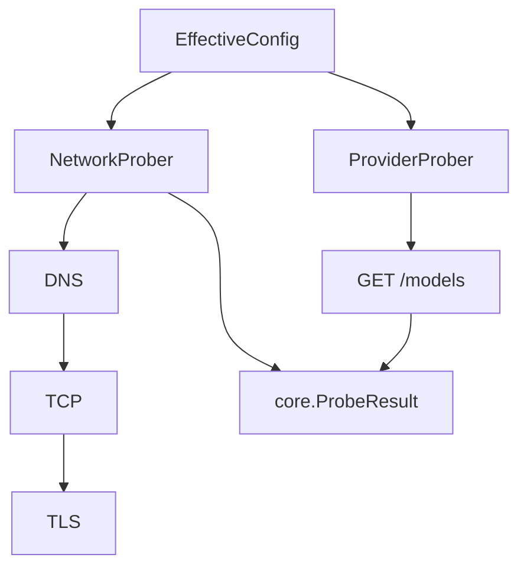
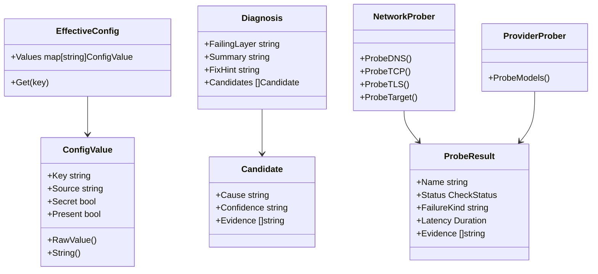
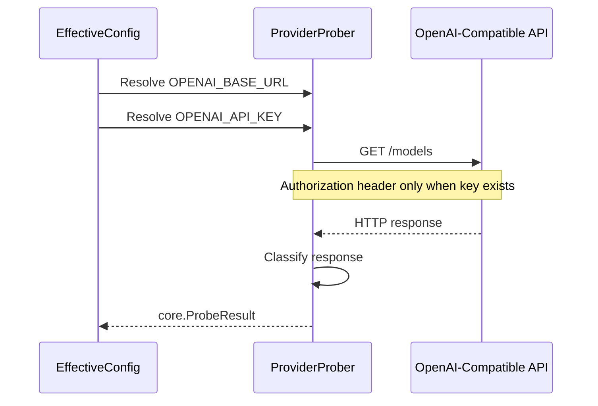
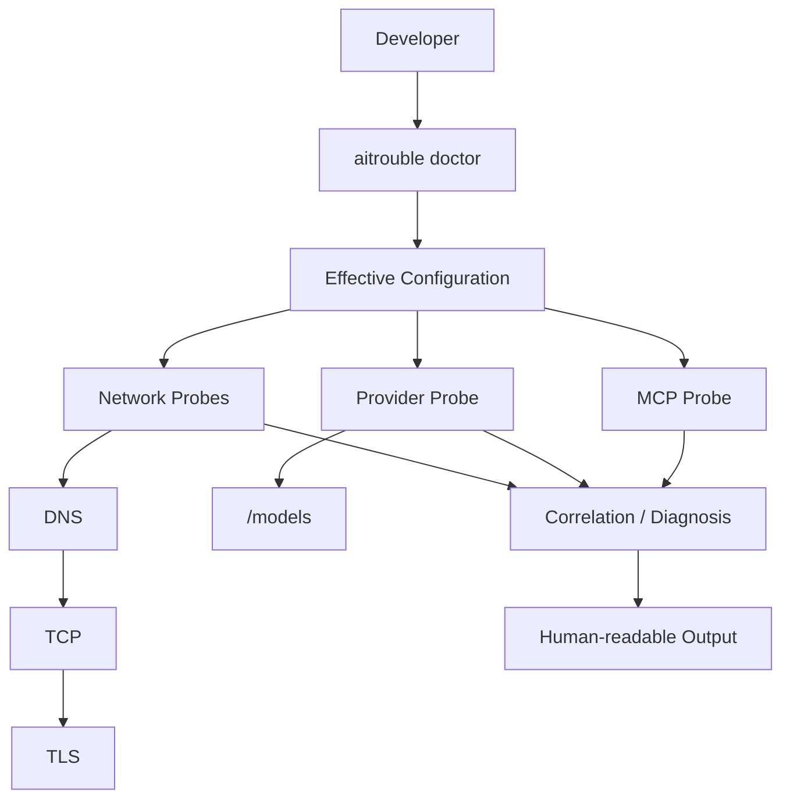
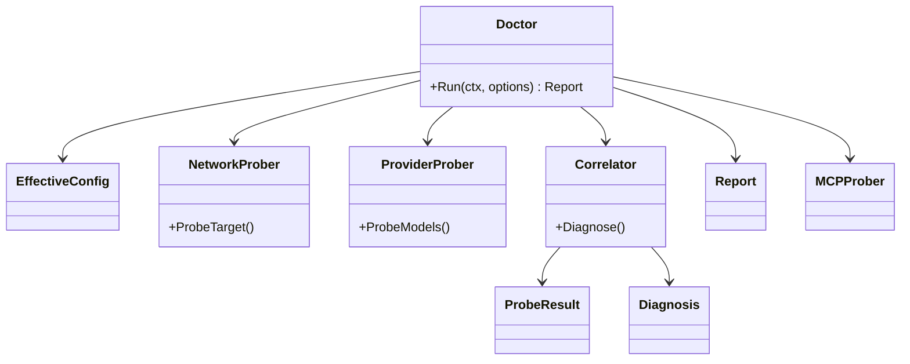

# Architecture

## 1. Purpose

aitrouble is a read-only, single-binary CLI tool designed to definitively diagnose AI integration failures across the local environment, network, and provider layers without leaking credentials.

## 2. Current System

The current system implements the core deterministic configuration resolution and the bottom-up network probing sequence (DNS, TCP, TLS) followed by a provider-level `/models` probe. 

The `doctor` CLI command, correlation engine, and human-readable output formatting are not yet implemented.

## 3. Production Package Structure

The current production packages are strictly decoupled from the CLI edge and do not use third-party dependencies:

- `internal/core`: Holds common domain types (`ProbeResult`, `EffectiveConfig`, `ConfigValue`) and local configuration resolution rules.
- `internal/network`: Executes deterministic DNS, TCP, and TLS probes. 
- `internal/provider`: Executes safe HTTP probes against OpenAI-compatible `/models` endpoints, classifying status codes without exposing raw response bodies or credentials.

## 4. Current Data Flow



## 5. Core Domain Model

The following types represent the real, implemented domain objects. 
(`Candidate` and `Diagnosis` exist as types but are not actively used by an engine yet).



## 6. Configuration Resolution

Currently supported configuration keys:
- `OPENAI_API_KEY`
- `OPENAI_BASE_URL`

Precedence:
```text
shell environment
        ↓
.env
        ↓
default
```

Current default:
`OPENAI_BASE_URL=https://api.openai.com/v1`

- `.env` is read locally.
- A missing `.env` is not treated as an error, but actual filesystem errors are surfaced.
- API keys are treated as secrets and formatted securely. `RawValue()` is provided strictly for internal HTTP request authorization.

*(Note: Profile-based configs, VS Code settings, or Cursor configs are not currently implemented.)*

## 7. Network Probe Flow

Network logic strictly uses standard library primitives.

HTTPS short-circuit behavior:
```text
DNS fail
    ↓
TCP skipped
TLS skipped

DNS pass
    ↓
TCP fail
    ↓
TLS skipped
```

HTTP short-circuit behavior:
```text
DNS → TCP (TLS is skipped entirely)
```

*(Note: ICMP, MTU, packet capture, or traceroutes are intentionally outside the network probe scope.)*

## 8. Provider Probe Flow

The provider probe executes an OpenAI-compatible API request using the resolved config.

```text
EffectiveConfig
      ↓
OPENAI_BASE_URL
      ↓
GET /models
      ↓
HTTP result
      ↓
core.ProbeResult
```

Authentication is injected safely:
`Authorization: Bearer <OPENAI_API_KEY>`

Result classification:
- `200` → `pass`
- `401` → `auth_failure`
- `403` → `auth_failure`
- `404` → `route_not_found`
- `429` → `rate_limited`
- `5xx` → `provider_server_error`
- `other non-2xx` → `provider_http_error`
- `invalid JSON / invalid data shape` → `provider_invalid_response`
- `timeout` → `http_timeout`
- `cancelled` → `http_cancelled`



## 9. Security Model

```text
API key
   ↓
EffectiveConfig
   ↓
Authorization header
   ↓
provider request

                 NOT:
ProbeResult.Name
ProbeResult.FailureKind
ProbeResult.Evidence
normal formatted output
```

API keys are guaranteed never to appear in evidence, failure strings, or JSON representations of results. 

To ensure safety against malicious API endpoints, if the remote server echoes the API key back in its error body, the returned `ProbeResult` still fully replaces the key with `[REDACTED]`.

## 10. Current Limitations

- `doctor` CLI is not implemented.
- Production correlation/orchestration is not implemented.
- MCP probing is not implemented.
- JSON output is not implemented.
- TUI is not implemented.
- LLM diagnosis is not implemented.
- Only `OPENAI_API_KEY` and `OPENAI_BASE_URL` are currently supported.
- Provider scope is currently restricted to OpenAI-compatible `/models`.

## 11. Planned Target Architecture

**Planned / not implemented**



**Planned / not implemented**



## 12. Design Principles

- **Local-first**: Diagnostics run locally without relying on external observability suites.
- **Zero telemetry**: We collect zero diagnostic data.
- **Read-only**: We inspect environments without modifying configuration.
- **Secret-safe**: Secrets must never touch stdout, stderr, or JSON reports.
- **Standard library first**: Pure Go standard library networking. No heavy third-party SDKs.
- **Deterministic probes**: Meaningful, categorised faults mapped from raw network primitives.
- **Explicit evidence**: Determinist facts are presented, not ambiguous guesses.
- **Short-circuit lower-layer failures**: Stop at DNS if DNS fails.
- **Small implementations**: Code footprint kept purposefully small and readable.
- **No premature abstraction**: Prefer the simplest implementation that satisfies the current requirement. Introduce abstraction only when there is a concrete need.
